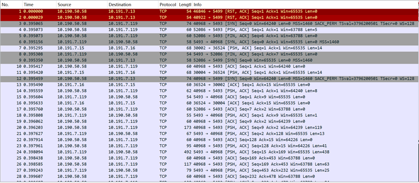
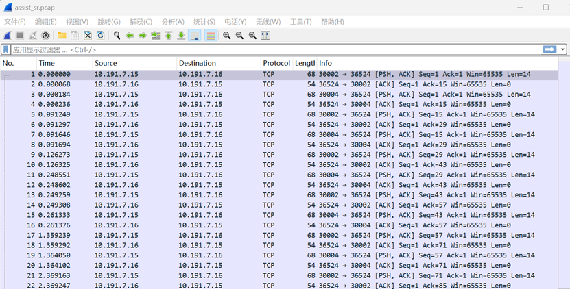
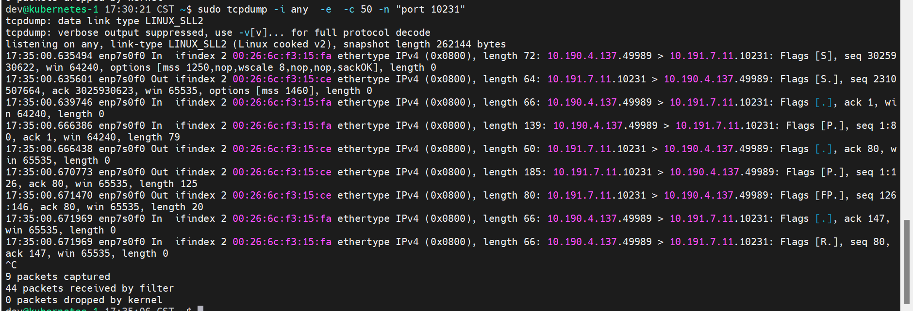
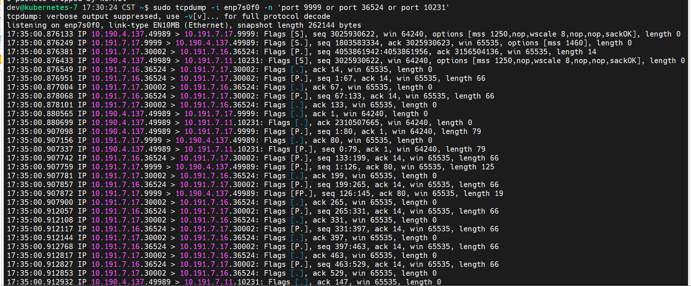

# TCPCOPY      Reference:https://github.com/session-replay-tools/tcpcopy
## 1.	What is the role of the intercept component? Why is it designed this way?
   
 The role of the intercept component is to make the target server think it is truly connected to the client.  The target server assumes it is communicating with the client, but it is not. Even though the packets captured at the target server show that the source IP is the client and the destination IP is the target server, these IPs are faked by the online server. The client never actually connects to the target server. The online server uses tcpcopy to change the destination IP and send the packets to the target server. When the target server receives these packets, it responds to them.(one may think target response to client directly, yet because of the route rule we add, the next hop would be assistant server instead of client)    
   
•	Spoofing the Connection: The online server uses tcpcopy to modify the destination IP of the packets to the target server's IP and sends them to the target server. The target server receives these packets and thinks they are from the client.   

•	Routing Rule: A routing rule (route add -net client IP netmask 255.255.255.0 gw assistant server) is added to the target server, ensuring that the responses from the target server to the client go through the assistant server.   

•	Intercepting Responses: The intercept component on the assistant server captures the responses from the target server and sends these response headers back to the online server. Intercept is used to avoid really sending packets to client. However, if a response is sent to the client, the client would drop the packet because the source IP does not match the expected IP.    

•	Maintaining Connection State: By receiving these response packets, the online server knows what to send next to the target server, allowing target server to continue thinking it is communicating with the client. Target server think client acknowledge response and send new request (However, this is still fake from online server).   

    
## 2. Can traffic copying still be performed after containerizing tcpcopy and intercept? What are the considerations?
   
Yes and No.     
    
When running each server in separate containers on different servers, the functionality remains intact. However, when the online server is on one server, and both the target and assistant servers are on another server but in different containers, there are issues. Setting them with new static IPs and placing them on the same bridge network while mapping out the ports to communicate with the online server results in unexpected behavior:     
    
- On the target server, packets captured indicate that it can no longer establish a standard three-way handshake with the client.     
- On the assistant server, the sequence numbers do not start from 1, which differs from previous observations when these servers were separated.      
Overall, tcpcopy and intercept can still perform traffic copying after being containerized, but several important considerations must be addressed to ensure correct functionality.    
#### Set Net Mode to Host:    
- Reason: If the network mode is not set to host, there could be issues with IP mapping, preventing tcpcopy and intercept from correctly capturing and handling traffic.
  
- Action: Configure the containers to use the host network mode, allowing tcpcopy and intercept to access network traffic as if they were running directly on the host.       

#### Add capability to container to have necessary permission:
- Online server: docker run --rm --net="host" --cap-add=NET_RAW --cap-add=NET_ADMIN newtcpcopy -x 9999-10.191.7.11:10231 -s 10.191.7.16 -c 10.190.4.137   

- Assistant server: docker run --rm --net="host" --cap-add=NET_RAW --cap-add=NET_ADMIN intercept -i eth0 -F 'tcp and src port 10231'   

The reason for using --cap-add=NET_RAW is that packet capture occurs at the datalink layer. This capability allows the capture of raw packets, not just TCP packets.     

## 3.	Simulate traffic diversion using a PostgreSQL service or a Python service as an example   
### PG Scenario Overview:   
1.	PG service Virtual IP and Real Server:   
o	Virtual IP: 10.191.7.119  
o	Real Server: 10.191.7.15  
o	MAC: 00:26:6c:f3:15:ae  
2.	Server Details:  
o	PostgreSQL Online Server: 10.191.7.119:5493  
o	Target Server IP: 10.191.7.13:5499  
o	Assistant Server: 10.191.7.16  
3.	Client Range:  

o	10.0.0.0/8

#### Packet caught at online server: online_sr.pcap      
    

#### Packet caught at target server: target_sr.pcap         
Packets purportedly sent from clients (10.190.50.58 and 10.191.7.12) to the target server are actually sent from the online server (MAC: 00:26:6c:f3:15:ae). This indicates that the online server is using tcpcopy to make the target server believe it is directly connecting to the clients.      
   
     
 
#### Packet caught at assist server: assist_sr.pcap,    
The assistant server continuously communicates with the online server (10.191.7.15).      

### Python Scenario Overview:   
1.	Python service Server (Online server):   
o	Server IP: 10.191.7.17   
o	MAC Address: 00:26:6c:f3:15:fa   
2.	Server Details:   
o	PostgreSQL Online Server: 10.191.7.17:9999   
o	Target Server IP: 10.191.7.11:10231   
o	Target Server MAC: 00:26:6c:f3:15:ce   
o	Assistant Server: 10.191.7.16   
3.	Client Range:   
o	10.190.4.137   

#### Caught at target server   
The target server believes it is directly communicating with the client, but the src mac address is online server’s MAC address 
    
 

#### Caught at assistant server   
- packet send from target to client route through assistant server, Ether src come from target server mac address (00:26:6c:f3:15:ce)     
.jpg)   
 
- assistant server constantly communicates with online server (10.191.7.15)    
       

#### Caught by online server:   
- directly communicate with client (10.190.4.137)   
- communicate with assistant server (10.191.7.16), as long as there is any action from client   
- fake the client traffic to target server (but when looking at MAC addr, know it is from online server instead)   

    
## 4.	At which layer of the ISO network model does tcpcopy operate? How does it intercept request traffic?       
#### Step 1: Capture Packets   
- Operation Layer: Data Link Layer (Layer 2)   
- Process: tcpcopy uses libpcap (a packet capture library) to sniff packets on the network interface.   
- Separation: Once tcpcopy captures a packet, it creates an in-memory copy of the packet. This copying process involves duplicating the packet's data, including the IP and TCP/UDP  headers, and the payload. Meanwhile, the original packet continues its journey up the stack in the online server.    
- Online Server Processing: The original packet is processed by the online server's networking stack, reaching the transport layer (TCP/UDP) and then the application layer. The online server processes the request and sends back a response to the client.    
#### Step 2: Create Copy   
- Operation Layer: Network Layer (Layer 3) and Transport Layer (Layer 4)   
- Process: tcpcopy examines the captured packet for:   
	-  IP Address (Layer 3)  
	-  Port Number (Layer 4)   
	-  Payload (Layer 4)   
- Duplication: tcpcopy immediately duplicates the packet's data in memory.   
#### Step 3: Modify Packet   
- Operation Layer: Network Layer (Layer 3) and Transport Layer (Layer 4)   
- Process: tcpcopy modifies the duplicated packet’s:   
	- Destination IP Address (Layer 3)    
	- Port Number (Layer 4)   
	- Payload (Layer 4) remains unchanged    
- Sending: The modified packet is sent to the target server using raw sockets, ensuring the target server processes the traffic as if it were from the original client.   
#### Summary   
tcpcopy operates by capturing packets at the data link layer (Layer 2) using libpcap, then accesses and duplicates the entire packet data, including the IP header (Layer 3) and TCP/UDP headers and payload (Layer 4). It then modifies the duplicated packet’s destination IP and port number before sending it to the target server. The original packet continues to be processed normally by the online server.    

## 5. Tips
- The assistant server uses port 36524 to communicate with the online server.
- The online server does not establish a TCP connection with the assistant server, even though they communicate with each other constantly.
- The online server communicates with the assistant server before sending fake traffic to the target server.
- The online server does not establish a TCP connection with the target server.
- The target server believes it has a normal connection with the client.
